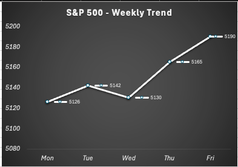
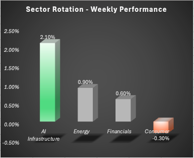

# 🌊 Signal & Flow — by SW  
### Your Weekly Market Brief

---

## Week 2 (April 27–May 1, 2026)

### 📊 Market Overview
- **S&P 500 (broad U.S. stock market index):** +1.3%  
- **NASDAQ (technology-focused index):** +1.9%  
- **10-Year Treasury Yield (benchmark interest rate):** ~4.6% (stable)  

---

## 📈 Signal  
Market strength continued this week, but gains remained concentrated rather than broad-based.  

→ *Signal reflects what current market data is indicating about direction and momentum.*

---

## 🌊 Flow  
Capital continued rotating into high-conviction areas—primarily AI infrastructure—while consumer-facing sectors lagged.  

→ *Flow shows where money is actually being invested across sectors.*

---

## 🎯 What This Means
- Market performance remains **selective, not uniform**  
- Returns are driven by a **small number of dominant themes**  
- Capital is becoming more **concentrated → increasing directional risk**  

---

## 📉 Visuals

### S&P 500 — Weekly Trend

### Sector Rotation — Weekly Performance

---

## 🧠 Takeaway
Markets aren’t just moving higher—they’re narrowing.  

Understanding **where capital is flowing** matters more than just tracking index performance.

---

## 🔁 Series Note
This is part of an ongoing weekly series focused on:
- Market structure  
- Capital allocation  
- Data-driven insights  

---

*Published by Sam Watson*  
